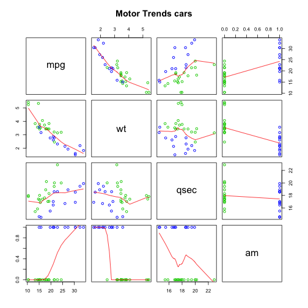
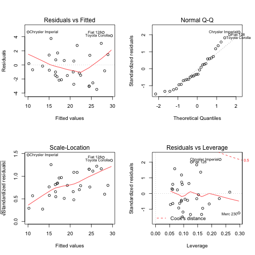

Impact of Transmission on MPG
========================================================
Motor Trend, a magazine about the automobile industry, is interested in exploring the relationship between a set of variables and miles per gallon (MPG) of a collection of cars.  
In this analysis, we will answer the following two questions:
* "Is an automatic or manual transmission better for MPG ?"
* "Quantify the MPG difference between automatic and manual transmissions"

## Exploratory Data Analysis
The data was extracted from the 1974 Motor Trend US magazine, and comprises fuel consumption and 10 aspects of automobile design and performance for 32 automobiles (1973–74 models).

The transmission ("am" variable) is binary and can take 2 values: 0 = automatic, 1 = manual.

```r
mtcars$am <- factor(mtcars$am, levels = c(0, 1), labels = c("automatic", "manual"))
```


We compare MPG for the automatic and manual transmission using Student t test: Our null hypothesis (H0) is "there is no difference in MPG between transmission" and our alternative hypothesis (Ha) is "automatic transmission have lower fuel consumption than manual"

```r
t.test(mpg ~ am, mtcars, alternative = "less")$p.value
```

```
## [1] 0.0006868
```

The p-value is lower than 0.05, the result is significant and the null hypothesis can be rejected.  
We can say that, when we assume that all other variables are same for automatic and manual transmission, automatic transmission is better than manual transmission for MPG.  
  
But, as shown in Figure 2 in Appendix, this is not the case: some variables of the dataset (like weight, for example) doesn't have the same distribution for automatic and manual transmission.


```r
round(sort(cor(mtcars)["mpg", -1]), 3)
```

```
##     wt    cyl   disp     hp   carb   qsec   gear     am     vs   drat 
## -0.868 -0.852 -0.848 -0.776 -0.551  0.419  0.480  0.600  0.664  0.681
```

Comparing the correlation of the caracteristic of a car with MPG, we notice that 3 variables are highly correlated with MPG (>.8): wt, cyl and disp.

## Model selection
We build a first model based on Simple Linear Regression.  


```r
fit.simple <- lm(mpg ~ am, mtcars)
summary(fit.simple)$adj.r.squared
```

```
## [1] 0.3385
```

The adjusted $R^2$ value indicates that the model explains only 34% of the variations. It's a very low value.

```
##             Estimate Std. Error t value  Pr(>|t|)
## (Intercept)   17.147      1.125  15.247 1.134e-15
## ammanual       7.245      1.764   4.106 2.850e-04
```

This model tells us that changing from automatic to manual transmission causes a 7.245 increase in MPG.

We then use the Stepwise Algorithm (step-by-step selection) to select a better model (keeping am variable in the model):


```r
fit.step <- step(lm(mpg~., mtcars), trace=0, scope=list(lower=~am), direction="both")
summary(fit.step)$call
```

```
## lm(formula = mpg ~ wt + qsec + am, data = mtcars)
```

The best model proposed by Stepwise includes the weight (wt) and the "1/4 mile time" (qsec) of the cars, in addition to transmission (am), to explain fuel consumption (MPG).  

```r
summary(fit.step)$adj.r.squared
```

```
## [1] 0.8336
```

The adjusted $R^2$ is 0.8336 which means that the model explains 83% of the variation.

### Model comparison and Residuals analysis
We then compare the model proposed by Stepwise with our first model based on Simple Linear Regression using ANOVA.

```r
anova(fit.simple, fit.step)[2, 6]  #p-value
```

```
## [1] 1.55e-09
```

The p-value is very low: we can then reject the null hypothesis (i.e. "Model are equals") and claim that the model proposed by the Stepwise algorithm is better than our first simple model.

The Figure 3 (in Appendix) is a residual plot of the selected model.  
Residuals seems to be uncorrelated with the fit, independent and (almost) identically distributed with mean zero.

## Results

```r
summary(fit.step)$coefficients
```

```
##             Estimate Std. Error t value  Pr(>|t|)
## (Intercept)    9.618     6.9596   1.382 1.779e-01
## wt            -3.917     0.7112  -5.507 6.953e-06
## qsec           1.226     0.2887   4.247 2.162e-04
## ammanual       2.936     1.4109   2.081 4.672e-02
```

Given the coefficients of our model, we can say that automatic cars have lower fuel consumption than manual cars: they have 2.94 miles per galon (MPG) more than manual cars. This value can be obtained when we consider the weight (wt) and the "1/4 mile time" (qsec) variables of the cars of our dataset.
  
   
   
   
## Appendix
### Figure 1: MPG by Transmission
 


### Figure 2: Scatterplot Matrix
 

Cars with *automatic* transmission are plot in green.  
Cars with *manual* transmission are plot in blue. 

### Figure 3: Residual plot for the selected model without and with interactions
 

 
